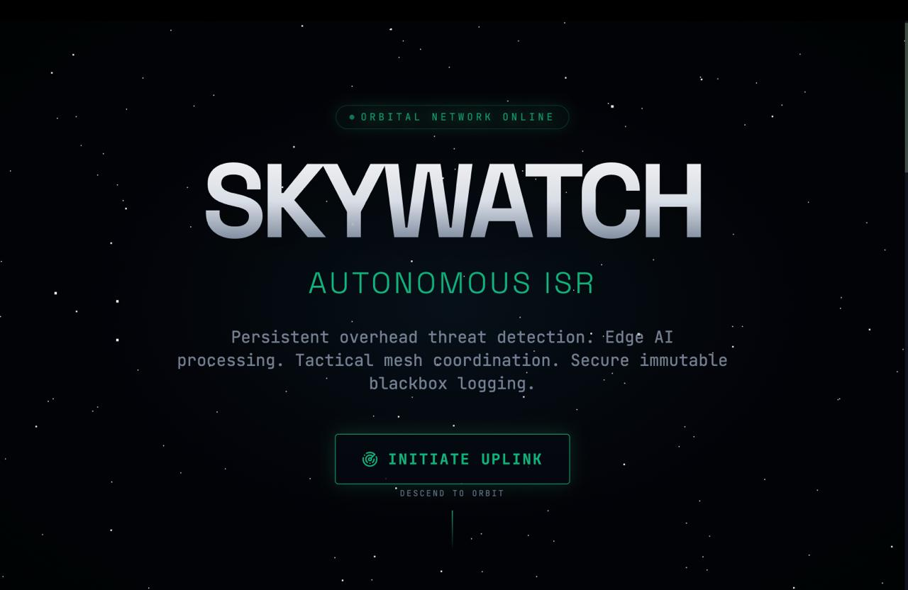
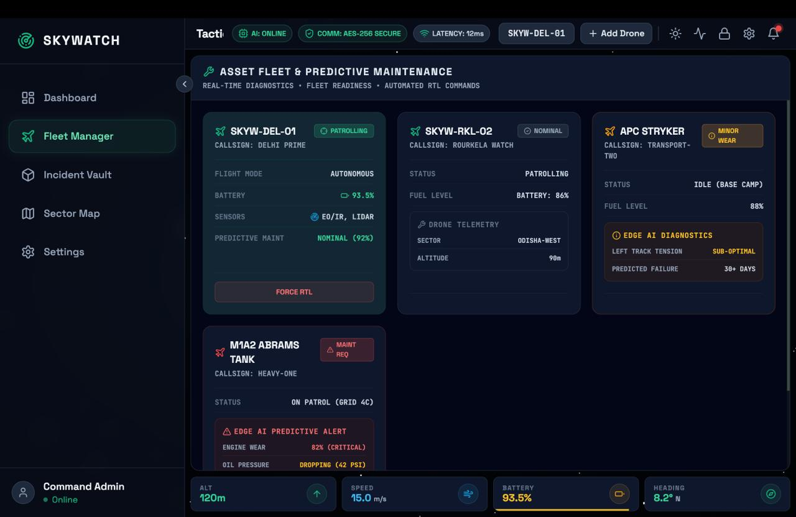
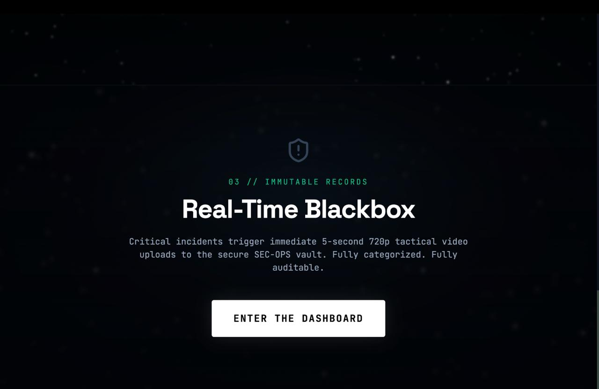
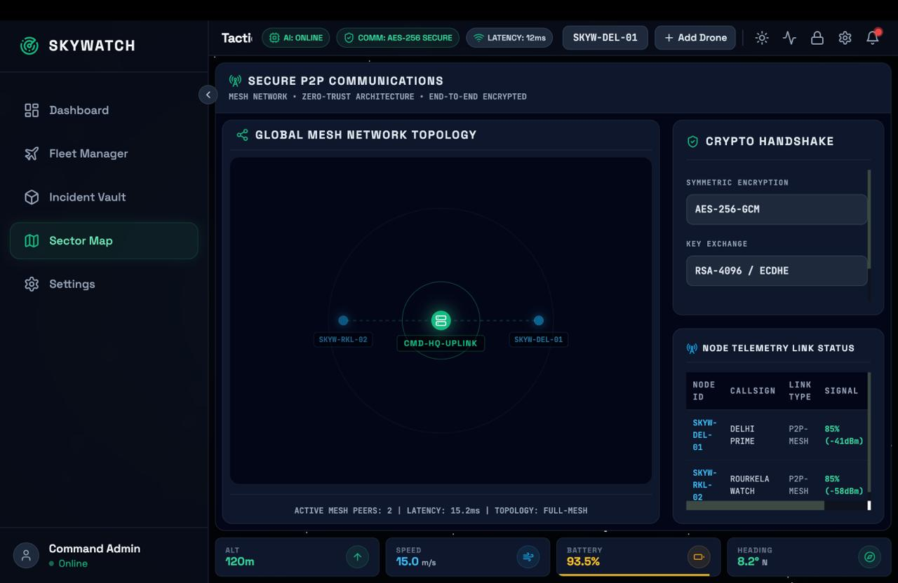
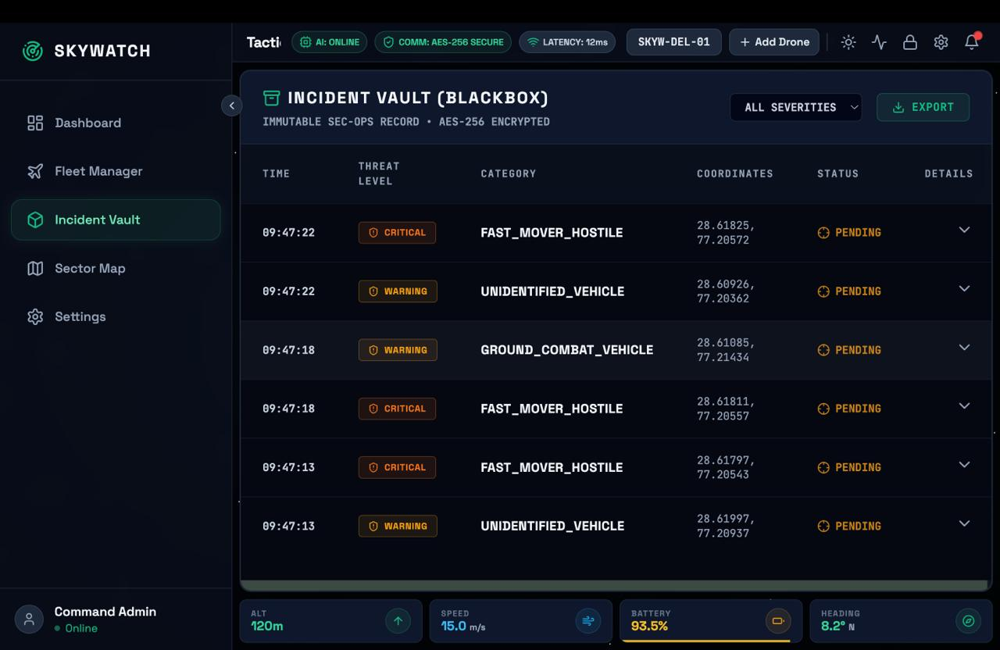
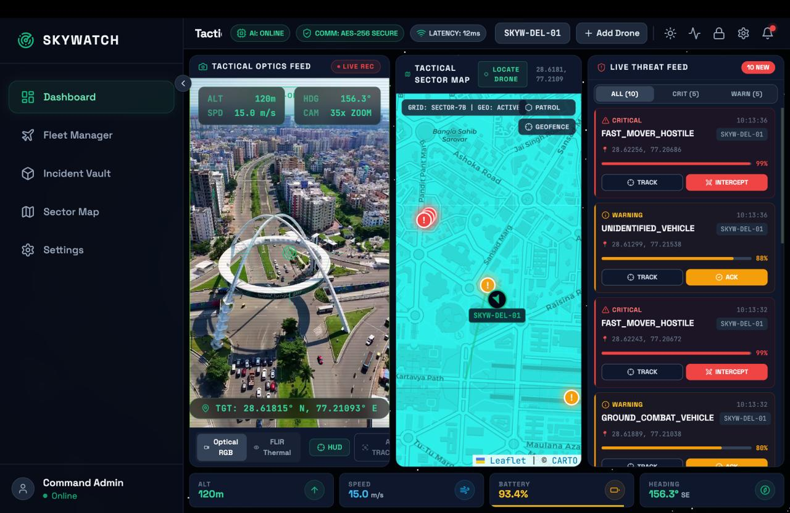
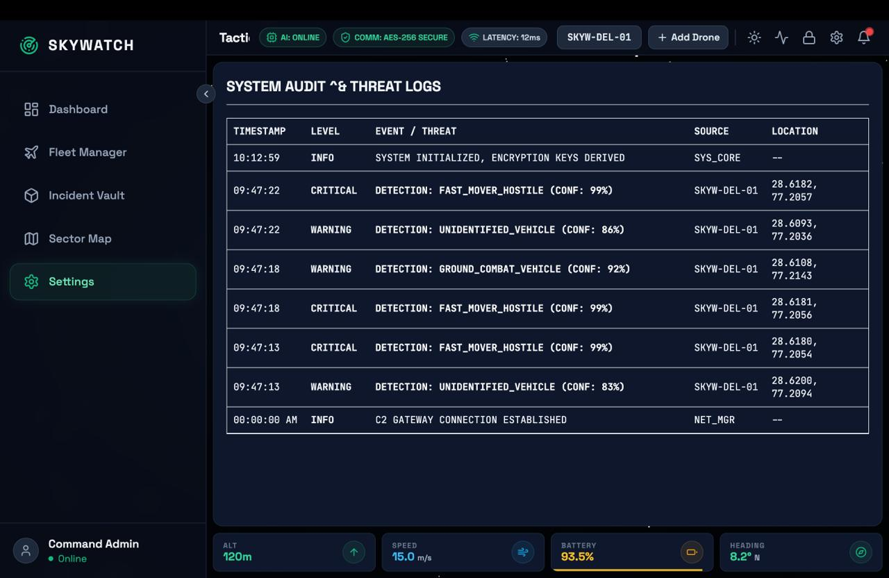

# SkyWatch - Autonomous ISR Tactical Command

Welcome to **SkyWatch**, a state-of-the-art drone fleet management and threat detection system designed with a high-performance "Bento-box" tactical interface.

## 🎥 Project Demonstration

**Watch the full project video here:** [SkyWatch Video Demonstration](https://drive.google.com/file/d/1fSqBI9X_bK3MB0uuoYUbbqMJ-skn9nvh/view?usp=sharing)

## 📸 Screenshots

## 🚀 Key Features

### 1. Fleet Management & Deployment
* **Asset Tracking**: View all active drones in the fleet manager with real-time status indicators.
* **Smart Geocoding Registration**: Deploy new drones by simply typing a real-world address (e.g., "1600 Pennsylvania Ave"). The system securely geocodes this address via OpenStreetMap and automatically assigns precise coordinates to the new drone's telemetry engine.
* **Stream Suggestions**: Quickly assign active video feeds to new drones using the built-in suggested stock feeds.

### 2. Tactical Sector Map
* **Live Telemetry & Trails**: The map continuously plots the location of your drones in real-time. A green trail renders behind the drone to trace its recent flight path.
* **Auto-Pan & Drone Locator**: When you switch drones in the Fleet Manager, the map camera automatically flies to the selected drone. If you pan away, you can use the "Locate Drone" crosshair button in the map header to instantly fly back to the active drone.
* **Draw Patrol Paths**: Enter `DRAW PATROL` mode to click and drop waypoints. Once saved, these waypoints are sent to the backend drone flight engine to dictate the drone's autonomous patrol route.
* **Geofence Mapping**: Enter `DRAW GEOFENCE` mode to create polygonal restricted zones. These are mapped in real-time and actively tracked by the backend.

### 3. AI Threat Simulator & Live Feed
* **Threat Injection Simulator**: Click the heart-rate activity icon to enable the AI Threat Simulator. This engine spoofs real-world threats (like Ground Combat Vehicles or Unauthorized Drones) near your active drone to test the system's response pipeline.
* **Live Threat Log**: Threats are ingested via a secure WebSocket connection and displayed in the Threat Log with their calculated confidence and severity.
* **Tracking Mode**: Click "Track" on any threat in the log to instantly lock the Tactical Map camera onto its precise coordinates for visual inspection.

### 4. Advanced Intercept Calculator
* **Predictive Targeting**: When a `CRITICAL` or `HOSTILE` moving threat is logged, you can command the drone to Intercept it.
* **Trajectory Math Engine**: The backend mathematically plots the threat's velocity and heading against the drone's location and top speed to predict where they will cross paths.
* **Visual Intercept Vector**: A red dotted line is instantly drawn on the Tactical Map connecting your drone to the calculated Intercept Point, complete with a live Time-To-Intercept ETA.

### 5. Optics & SEC-OPS Telemetry
* **Simulated Optics Overlay**: The Optics module displays the drone's live RTSP/MP4 feed overlaid with dynamic HUD elements like Lidar range, altitude, and artificial crosshairs.
* **Encrypted Pipeline**: All telemetry and threats sent from the backend are encrypted using military-grade `AES-256-GCM`.
* **Cipher Stream Log**: Watch the SEC-OPS terminal to see the raw Ciphertext, Initialization Vectors (IV), and Auth Tags streaming in real-time before they are decrypted by the frontend client.
* **Real-Time Blackbox**: Critical incidents trigger immediate 5-second 720p tactical video uploads to the secure SEC-OPS vault. Fully categorized and auditable.

### 6. Dashboard Settings
* **Audio Alarms**: Toggle audible siren alerts for incoming `WARNING` or `CRITICAL` threats.
* **Data Saver**: Limits WebSocket telemetry frame ingestion by 80% to save render cycles on low-end hardware.
* **High Contrast**: Toggles the Tactical Map from a dark tactical view to a bright, high-contrast light mode for better visibility in bright environments.

---

## 🛠️ Tech Stack & Architecture

- **Frontend**: React, Vite, Tailwind CSS, Leaflet/Mapbox for Tactical Map.
- **Backend**: Node.js, Express, Socket.IO, MongoDB.
- **Edge-AI**: Python, OpenCV, YOLOv8 for edge threat detection and geofence breach analysis.

## ⚙️ How to Run on Localhost (Port 3000)

1. Make sure you have **Node.js** and **Python 3.x** installed on your system.
2. Open a terminal in the root directory of the project.
3. Run the `start_all.bat` script to install dependencies (if missing) and initialize all components concurrently:
   - Node.js backend gateway (Port 8080)
   - Vite frontend dashboard (Port 3000)
   - Edge-AI detector
4. The script will automatically open your default web browser to the dashboard.
   - Alternatively, you can manually open your browser and navigate to: `http://localhost:3000`

> **Note:** Ensure port `3000` is not being used by another application. If you need to stop the application, you can run the `stop_skywatch.bat` script or press `Ctrl+C` in the respective terminal windows.
